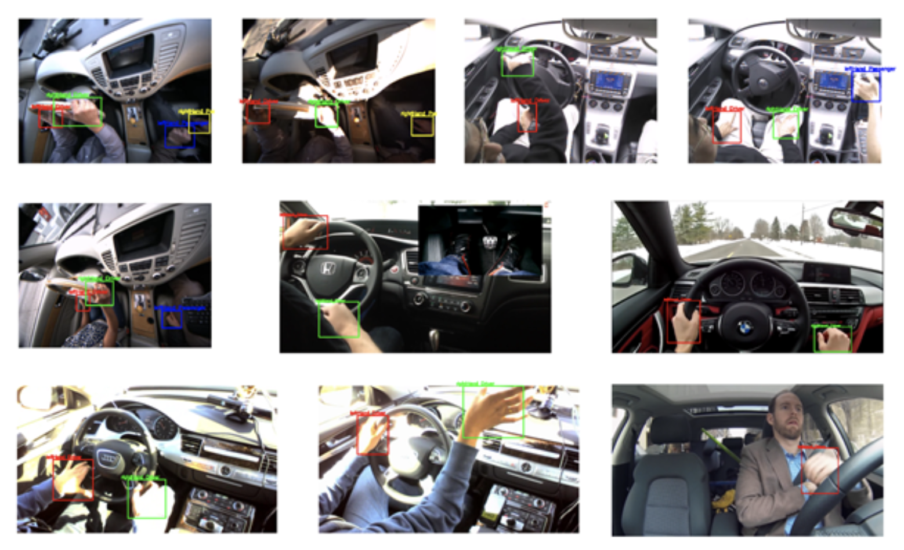

# HandDetection
This is a Modify faster-rcnn hand detection project, developed during my research assistant in Centre of Artificial Intelligence (CAI) in UTS.  
This project achieves Top 10 performance in VIVA hand detection competition.

Setup via [https://github.com/endernewton/tf-faster-rcnn](https://github.com/endernewton/tf-faster-rcnn)

Modified the code via [Robust Hand Detection in Vehicles](http://ieeexplore.ieee.org/stamp/stamp.jsp?arnumber=7899695) for hand detection.

This project is collaboration with my collegue Yunqiu Xu (https://github.com/YunqiuXu).

# Preprocessing
~/tf-faster-rcnn-endernewton/data/LISA_HD_Static/detectiondata$ python LISA_posGt_to_VOC_Annotations.py  
~/tf-faster-rcnn-endernewton/data/LISA_HD_Static/detectiondata$ python LISA_posGt_to_VOC_Main.py  

# Train
~/tf-faster-rcnn-endernewton$ ./experiments/scripts/train_faster_rcnn.sh 0 pascal_voc vgg16  

# Test
Modifiy the iter times in test_faster_rcnn.sh  
~/tf-faster-rcnn-endernewton$ ./experiments/scripts/test_faster_rcnn.sh 0 pascal_voc vgg16  

# How to do prediction on your own dataset

cd tf-faster-rcnn-endernewton/data/LISA_HD_Static/detectiondata/ImageSets/Main  
mv test.txt test_for_train.txt  
mv test5500.txt test.txt  

cd tf-faster-rcnn-endernewton/data/LISA_HD_Static/detectiondata  
mv JPEGImages JPEGImages_train  
mv JPEGImages_test JPEGImages  

Open tf-faster-rcnn-endernewton/experiments/scripts/test_faster_rcnn.sh  
Set line 21 "ITERS = the iters of the model you trained" Say if you trained a model with 10000 iters, set this line "ITERS = 10000"  

cd tf-faster-rcnn-endernewton  
./experiments/scripts/test_faster_rcnn.sh 0 pascal_voc vgg16  

# How to stop the training

tmux attach  
ctrl+c

